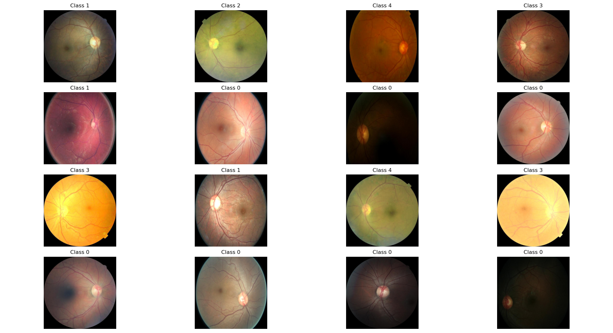

# MAE-Fundus

Developed a foundation model for fundus image analysis using Masked Autoencoders (MAE) implemented in PyTorch Lightning with parallel computing support.

## Table of Contents

- [Introduction](#introduction)
- [Features](#features)
- [Installation](#installation)
- [Usage](#usage)
- [Training](#training)

## Introduction

MAE-Fundus is a project aimed at developing a robust foundation model for analyzing fundus images. By leveraging Masked Autoencoders (MAE) and the capabilities of PyTorch Lightning, this project ensures efficient training and scalability, even on multiple GPUs. The primary goal is to enhance the understanding and diagnosis of various eye conditions through advanced image analysis.

## Features

- **Masked Autoencoders (MAE)**: Utilizes MAE for effective representation learning.
- **PyTorch Lightning**: Ensures modular, scalable, and efficient training processes.
- **Parallel Computing**: Supports distributed data parallel (DDP) strategy for training on multiple GPUs.
- **Fundus Image Analysis**: Specifically designed for processing and analyzing fundus images.

## Installation

To get started with MAE-Fundus, clone the repository and install the required dependencies:

```bash
git clone https://github.com/yourusername/MAE-Fundus.git
cd MAE-Fundus
pip install -r requirements.txt
```

Ensure you have PyTorch Lightning installed. If not, you can install it using pip:

```bash
pip install pytorch-lightning
```

## Usage

The following command is used to run the pretraining process for the MAE-Fundus model:

```bash
python -m train_main --accelerator gpu --strategy ddp_find_unused_parameters_true --data_dir /Users/leo/Desktop/MAE-Fundus/data/EAMDR --gpus 2 --num_workers 4 --batch_size 64 --epoches 100
```

## Training

To pretrain the model using Masked Autoencoders on fundus images, execute the training script with the specified parameters:

```bash
python -m train_main \
    --accelerator gpu \
    --strategy ddp_find_unused_parameters_true \
    --data_dir /Users/leo/Desktop/MAE-Fundus/data/EAMDR \
    --gpus 2 \
    --num_workers 4 \
    --batch_size 64 \
    --epoches 100
```


